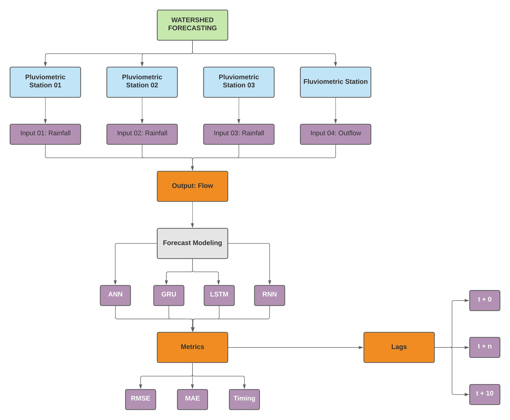

# Watershed-Prediction-by-Neural-Networks

This repository is based on a project that modelg the rainflow of a watershed. For that, we proposed
the application of 4 Neural Networks to predict the final outflow based on temporal rain (rainfall) and on the
resulting outflow of the Watersheds analized.

## Watershed
As the aim of this repository, we studied a Watershed located in the south of Brazil, in the state of Rio Grande do Sul.
That covered several municipalities, such as: Getúlio Vargas, Erechim, Gaurama and Tapejara.

## Inputs
As inputs, we used the data from 3 Pluviometric Stations and 1 Fluviometric Station, in the total of 4 inputs.

## Outputs
As outputs, we predicted the final Outflow of the Watershed, based on the inputs.

## Neural Networks
The study was divided and predicted based on 4 different architectures, as the following: ANN, GRU, LSTM and RNN.

## Lags
We considered lags to set the best parameter to be chosen for the forecasts. As that, the lags 1, 3, 5, 10 and 30 were selected.

## Forecasts
In order to have a robust prediction and a reasonable comparison, we selected several forecasts for the output.
So, we considered: t + 0, t + 1, t + 3, t + 5 and t + 10. These results were an accurate method to evalueate the models 
and their capacity to forecast by considering the metrics for every step.

## Metrics 
The best rainfall model for us were set based on the evaluation of the metrics. For that, we used some classical modeling metrics,
such as: RMSE, MAE and the timing of the training and fitting stage of each model. All the process could checked on the Fluxogram. to better 
understand. the workflow.

## Fluxogram 
The workflow of this repository is shown in the following Fluxogram.
 

## Summary of the parameters
As we used several lags steps and forecasts, each Neural Network was optimized based on the best performance for the forecast 't + 0',
by reaching the best proposed metrics. After that, the forecasts were conduceted: t + 0, ... , t + 10. The following table summurized the
parameters for each combination.

|Neural Network|Selected Lag|Forecasts (t)|
|---|--|------------------|
|ANN|10|t + 0, ..., t + 10|
|GRU|10|t + 0, ..., t + 10|
|LSTM|30|t + 0, ..., t + 10|
|RNN|10|t + 0, ..., t + 10|
